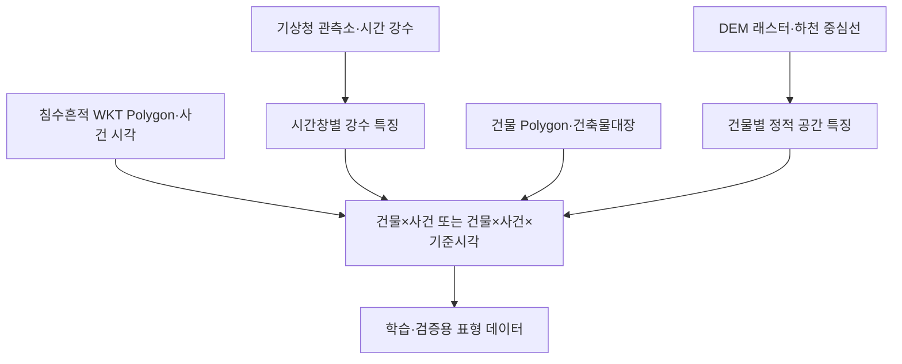

# Waterpark 전처리 계획과 XGBoost 적용 가능성

> 확인일: 2026-08-22
>
> 상태: 원본 전체를 받기 전의 구조적 타당성 분석. 학습 또는 성능 주장이 아니다.

## 1. 결론

현재 제안한 데이터는 **XGBoost용 표형 데이터로 가공할 수 있는 구조**다. 강수·고도·지하층·하천 거리처럼 숫자형 특징이 많고 비선형 상호작용을 기대할 수 있어 XGBoost 베이스라인과 잘 맞는다.

다만 실제 적용 가능성을 좌우하는 것은 알고리즘보다 다음 세 가지다.

1. 포항에 서로 다른 침수 사건이 충분히 있는가?
2. 침수흔적도의 시작 시각과 Polygon을 신뢰할 수 있는가?
3. “침수되지 않음”을 의미하는 음성 라벨을 올바르게 만들 수 있는가?

건물 행이 수만 개여도 침수 사건이 한두 개라면 독립적인 학습 표본은 한두 사건에 가깝다. 이 경우 XGBoost를 실행할 수는 있어도 새로운 호우에 일반화된 모델이라고 보기 어렵다.

## 2. 학습 행의 정의

### A. 사건 단위 모델

```text
한 행 = building_id + event_id
target = 해당 호우 사건 동안 건물 침수 영역 중첩 여부
```

예시:

| building_id | event_id | rain_1h_max | rain_6h | rain_24h | elevation_m | relative_elevation_m | underground_floor_count | river_distance_m | flooded_in_event |
| --- | --- | ---: | ---: | ---: | ---: | ---: | ---: | ---: | ---: |
| A001 | TYPHOON-2022-09 | TBD | TBD | TBD | TBD | TBD | 2 | TBD | 1 |

이 형태는 “이 호우 사건에서 이 건물이 침수 영역과 겹쳤는가”를 학습할 수 있다. 하지만 사건 전체의 강수량을 사용하므로 **1시간 전 예측 모델은 아니다**.

### B. 1시간 위험 모델

```text
한 행 = building_id + event_id + as_of_time
target = as_of_time 이후 1시간 안에 침수가 시작됐는가
```

예시:

| building_id | event_id | as_of_time | rain_prev_1h | rain_prev_6h | rain_prev_24h | elevation_m | relative_elevation_m | underground_floor_count | river_distance_m | flood_next_1h |
| --- | --- | --- | ---: | ---: | ---: | ---: | ---: | ---: | ---: | ---: |
| A001 | TYPHOON-2022-09 | 2022-09-06 03:00 KST | TBD | TBD | TBD | TBD | TBD | 2 | TBD | 1 |

Waterpark의 1시간 예측에 더 가까운 형태는 B다. 이때 `as_of_time` 이후 실제 강수량을 입력에 포함하면 데이터 누수가 발생한다. 현재 제안된 기상청 관측자료만 사용한다면 과거 강수 패턴으로 다음 1시간을 예측하는 모델이며, 향후 강수를 직접 반영하려면 예측 시점에 이용 가능했던 기상 예보 자료가 별도로 필요하다.

## 3. 전처리 흐름



### 3.1 공통 좌표와 시간

- 모든 시간은 KST 기준의 timezone-aware datetime으로 정규화한다.
- 공간 연산 전 각 데이터의 CRS를 확인하고 미터 단위의 공통 투영좌표계로 변환한다.
- 침수 샘플에는 CRS가 명시되지 않았으므로 추정 좌표계로 바로 교차하지 않는다.
- 위·경도 좌표에서 직접 거리 계산을 하지 않는다.

### 3.2 침수 라벨 생성

기본 양성 라벨 후보:

```text
building_polygon intersects flood_polygon → flooded = 1
```

단순 `intersects`는 경계가 조금 닿는 경우도 양성으로 만든다. 따라서 다음 값을 함께 계산해 확인하는 편이 낫다.

- 건물 면적 중 침수 Polygon과 겹친 비율
- 건물 중심점 포함 여부
- 침수 깊이와 등급
- 침수 시작일·시각의 유효성

중요한 한계: 침수흔적 Polygon과 건물이 겹친다는 것은 지표면 침수의 대리 라벨이며, 해당 건물의 **지하주차장이 실제 침수됐다는 직접 기록은 아니다**.

### 3.3 음성 라벨 생성

다음 규칙은 사용하지 않는다.

```text
침수 Polygon에 포함되지 않은 전국 모든 건물 → flooded = 0
```

침수흔적도가 조사되지 않은 곳이나 누락된 곳도 0으로 바뀔 수 있기 때문이다. 음성 후보는 최소한 같은 사건·같은 영향권 또는 확인 가능한 조사 범위 안에서 Polygon 밖에 있는 건물로 제한해야 한다. 조사 범위를 구할 수 없다면 `0`과 `미확인`을 구분해야 한다.

### 3.4 강수 특징 생성

기준 시각 `t`에서 과거 관측만 사용하는 경우:

| 파생 특징 | 계산 |
| --- | --- |
| `rain_prev_1h` | `(t-1h, t]`의 `RN` 합계 |
| `rain_prev_6h` | `(t-6h, t]`의 `RN` 합계 |
| `rain_prev_24h` | `(t-24h, t]`의 `RN` 합계 |
| `max_hourly_rain_prev_6h` | 최근 6시간의 최대 시간강수량 |
| `rain_intensity_now` | `t`의 `RN_INT` |
| `station_distance_m` | 건물과 사용 관측소 사이 거리 |

`RN_DAY`는 자정 이후 누적값이므로 6시간·24시간 특징을 그대로 대신하지 않는다. `RN` 결측은 0mm와 구분하고 `IR` 및 품질 정보를 확인한다.

한 ASOS 지점만 사용할 경우 동일 시각의 모든 포항 건물에 같은 강수값이 복제된다. 여러 ASOS/AWS 지점을 사용한다면 최근접 지점, 거리 가중 보간 또는 격자화를 선택할 수 있지만 실제 지점 분포를 본 뒤 결정한다.

### 3.5 건물 특징 생성

| 파생 특징 | 원본 후보 | 주의점 |
| --- | --- | --- |
| `building_id` | GIS건물통합정보 또는 관리건축물대장PK | 실제 연결 키 확인 필요 |
| `main_purpose` | 건축물대장 주용도 | 범주 정리 필요 |
| `underground_floor_count` | 건축물대장 지하층수 | 지하주차장 존재와 동일하지 않음 |
| `parking_capacity` | 건축물대장 주차 관련 속성 | 지하·지상 구분 가능 여부 확인 필요 |
| `building_area` | 건물 Polygon 또는 건축면적 | 중복 건물·부속건물 처리 필요 |

### 3.6 DEM 특징 생성

DEM은 행 형태가 아니라 래스터로 처리한다.

- 건물 중심점의 표고
- 건물 Polygon 내 평균·최소 표고
- 주변 반경 평균 표고와 건물 표고의 차이
- 주변 경사도

`lowland_score` 계산식과 주변 반경은 실제 DEM 해상도를 확인한 뒤 정한다.

### 3.7 하천 거리 생성

건물 Polygon과 가장 가까운 하천 중심선 사이의 미터 단위 최단거리를 계산한다.

```text
river_distance_m = distance(building_polygon, nearest_river_line)
```

하천 거리만으로 배수·내수침수 조건을 설명할 수 있는 것은 아니므로 후보 특징으로 두고 실제 데이터에서 기여도를 확인한다.

## 4. XGBoost에 적합한 점

- 숫자형·범주형으로 정리 가능한 표 데이터다.
- 강수와 지형의 비선형 관계 및 상호작용을 트리로 표현할 수 있다.
- XGBoost 트리 부스터는 `NaN` 결측 분기 방향을 학습할 수 있다.
- 양성 침수 사례가 적은 불균형 분류에서 가중치 조정 기능을 사용할 수 있다.

결측 처리가 가능하다는 것은 데이터 누락을 무시해도 된다는 뜻이 아니다. “0mm 강수”와 “강수 데이터 없음”은 반드시 다른 값으로 유지한다. XGBoost의 공식 문서도 트리 부스터가 결측 분기를 학습하고, 불균형 데이터에 `scale_pos_weight`를 사용할 수 있다고 설명한다.

## 5. XGBoost 적용을 막을 수 있는 조건

| 조건 | 영향 |
| --- | --- |
| 독립 호우 사건 수가 매우 적음 | 건물 행이 많아도 특정 사건을 암기해 일반화 성능을 평가할 수 없음 |
| 침수 시작 시각이 없거나 일 단위뿐임 | 1시간 선행 라벨 생성 불가, 사건 단위 모델로만 축소 가능 |
| 침수흔적 조사의 커버리지가 불명확함 | 신뢰할 수 있는 음성 라벨 생성 어려움 |
| 건축물대장과 건물 Polygon 매칭률이 낮음 | 지하층 특징과 라벨을 같은 건물에 결합하기 어려움 |
| 포항 ASOS 한 지점만 사용 | 한 사건 내 강수 특징이 모든 건물에서 같아 공간적 강우 차이를 학습하지 못함 |
| 실제 DEM 래스터를 확보하지 못함 | 고도·저지대 특징 생성 불가 |
| 사건 전체 강수량을 사전 예측 입력으로 사용 | 미래 정보 누수로 성능이 과대평가됨 |

## 6. 학습·평가 데이터 분리 원칙

무작위 행 분할은 사용하지 않는다. 같은 건물과 같은 호우 사건이 학습·검증 양쪽에 들어가면 거의 동일한 강수와 공간 특징이 복제되어 성능이 부풀려질 수 있다.

우선 분리 단위:

1. 호우 사건 단위 분리
2. 가능하면 시간 순서 분리
3. 지역 확장을 평가할 때 시군구 단위 분리

정확도는 침수처럼 양성이 적은 문제에서 의미가 약하다. 양성 재현율, 정밀도, PR-AUC와 사건별 결과를 함께 봐야 한다.

## 7. 현재 판단

| 판단 항목 | 결론 |
| --- | --- |
| 표형 데이터 구성 | 가능 |
| XGBoost 실행 | 가능 |
| 사건 단위 침수 위험 분류 | 데이터 확보 조건부로 가능성이 높음 |
| 건물 단위 1시간 선행 예측 | 시작 시각·음성 라벨·독립 사건 수 확인 전에는 판단 불가 |
| 현재 데이터만으로 높은 신뢰도의 모델 주장 | 불가 |

따라서 현재의 가장 정확한 표현은 다음과 같다.

> 데이터 구조는 XGBoost 베이스라인에 적합하다. 실제 성립 여부는 최종 행 수보다 **양성 건물 수, 독립 호우 사건 수, 라벨 시각 정밀도와 음성 라벨 품질**을 확인한 뒤 결정된다.

## 8. 참고한 공식 자료

- [행정안전부 침수흔적도](https://www.safetydata.go.kr/disaster-data/view?dataSn=108)
- [기상청 API허브 ASOS/AWS](https://apihub.kma.go.kr/apiList.do)
- [기상자료개방포털 포항 관측지점 138](https://data.kma.go.kr/tmeta/stn/selectStnDetail.do?isSelectStn=Y&pgmNo=82&stdStnNo=138)
- [국토교통부 건축물대장 표제부](https://www.data.go.kr/data/15044720/fileData.do)
- [VWorld GIS건물통합정보](https://www.vworld.kr/dtmk/dtmk_ntads_s002.do?svcCde=NA&dsId=18)
- [국토지리정보원 수치표고성과내역](https://www.data.go.kr/data/15067637/fileData.do)
- [VWorld 국가기본도 하천중심선](https://www.vworld.kr/dtmk/dtmk_ntads_s002.do?svcCde=MK&dsId=20250122DS00008)
- [XGBoost 결측값 FAQ](https://xgboost.readthedocs.io/en/release_3.2.0/faq.html)
- [XGBoost 불균형 분류 파라미터](https://xgboost.readthedocs.io/en/stable/parameter.html)
